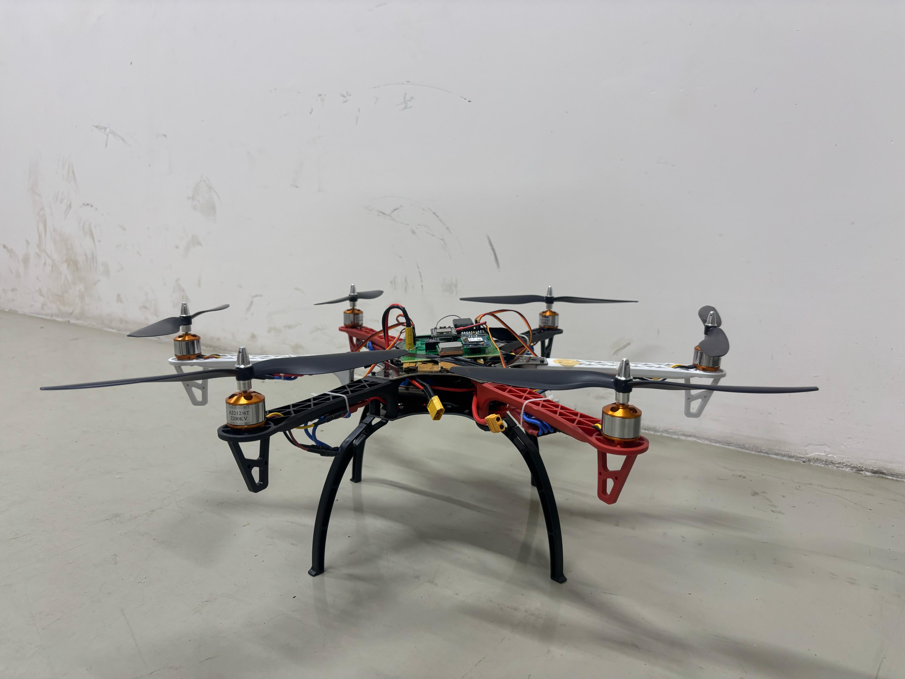
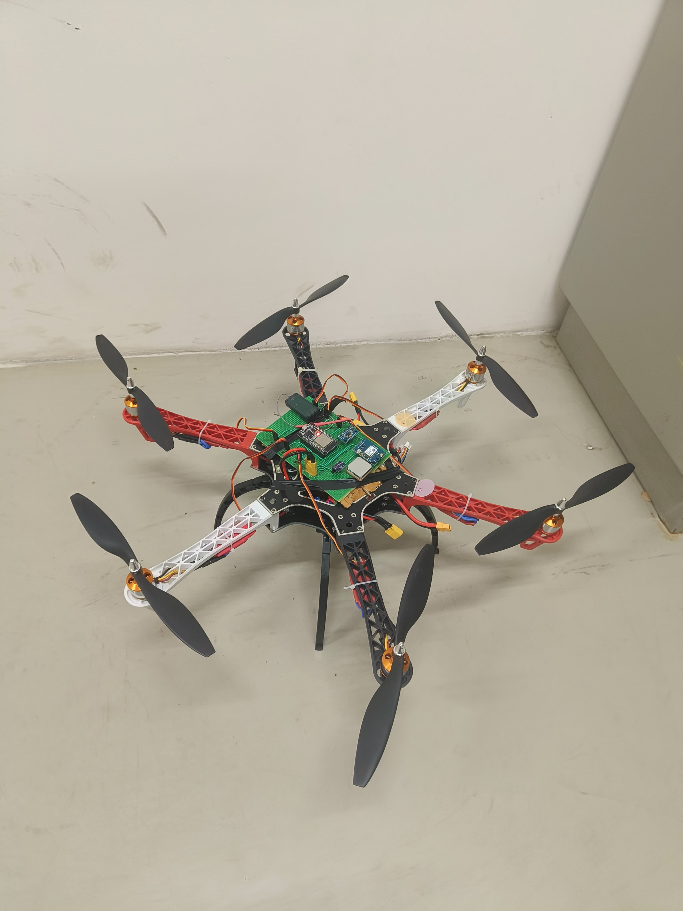
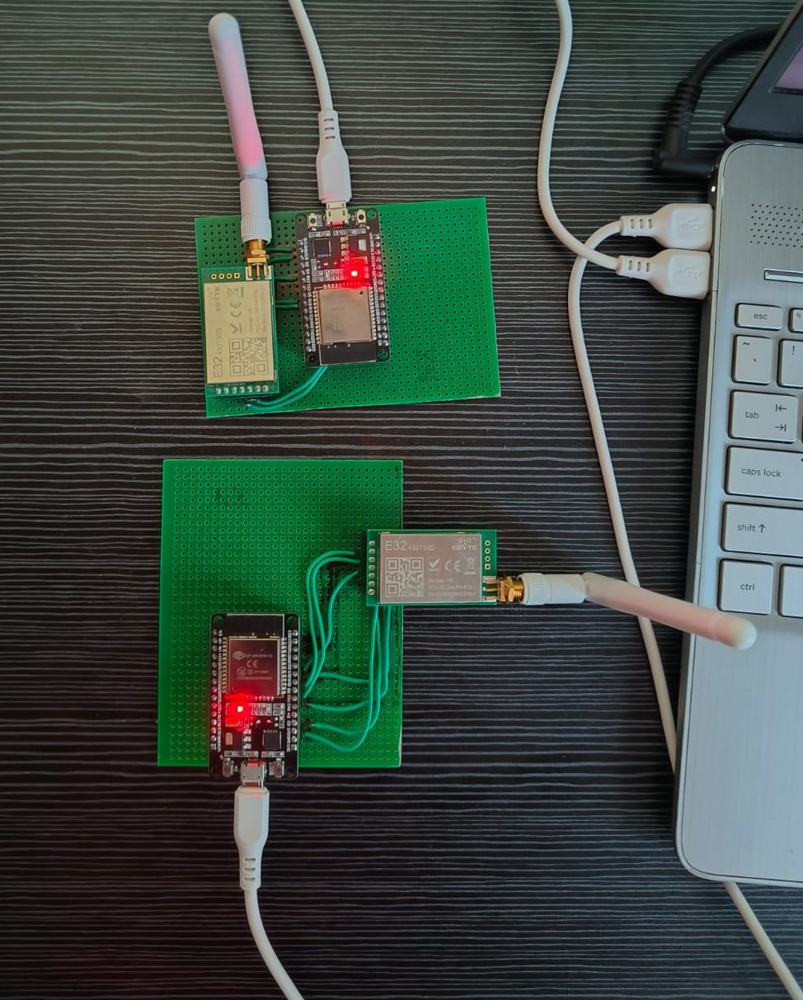
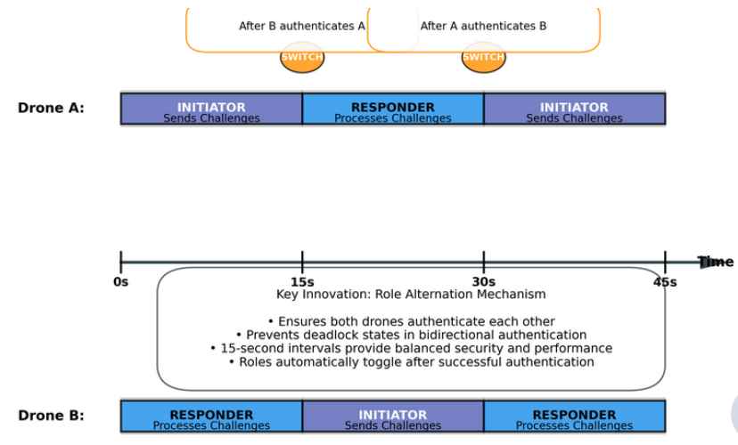
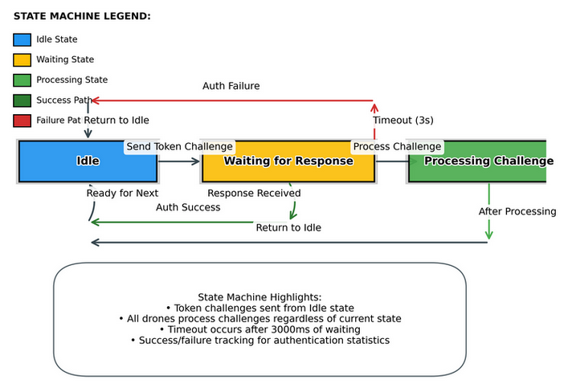
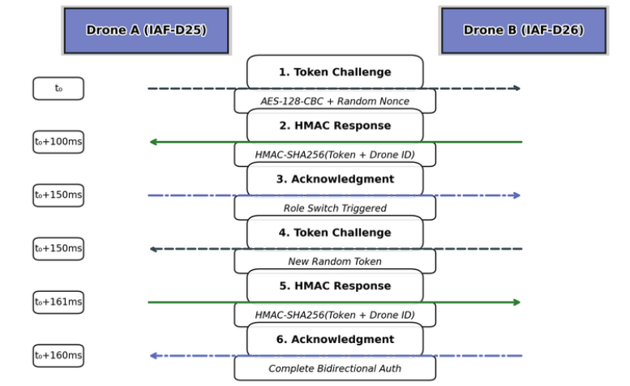
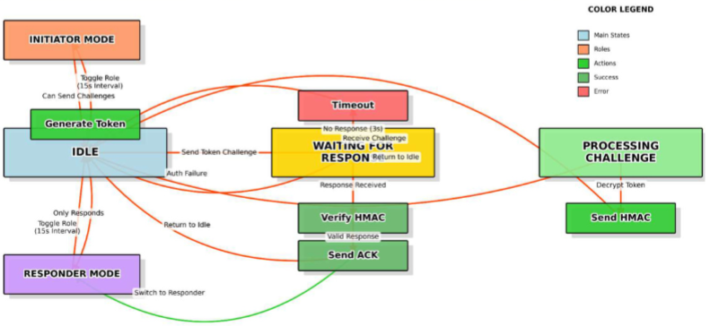
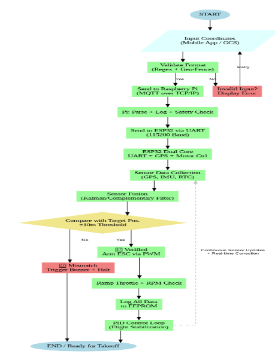

# Autonomous UAV Flight Controller & Identification Friend or Foe Systems

## Project Overview

This Capstone Project developed advanced, integrated solutions to enhance the security and flight control of Unmanned Aerial Vehicles (UAVs), addressing critical challenges in authentication and autonomy for robust real-world applications.

## Problem Statement

Our project tackled two main issues:
1.  **Secure Identification and Authentication:** Existing military IFF systems suffer from deadlocks, spoofing vulnerabilities, and are often too bulky for smaller drones. Furthermore IFF systems for modern FPV and other UAV's are almost non existent hence increasing the security challenges and the threat of friendly fire in combat conditions.
2.  **Autonomous Flight Control:** Commercial flight controllers are expensive, imported, and lack customization, hindering indigenous drone development and novel algorithm prototyping.

## High-Level Solutions

We developed two integrated solutions:

### 1. IFF (Bidirectional Yet Collision-Avoiding Secure Transmission - Identification Friend or Foe System)

A secure, autonomous identification system for military drones.
* **Core:** Uses ESP32 and LoRa with AES-128-CBC encryption and HMAC-SHA256 for secure token exchange.
* **Key Innovation:** Implements a unique role-alternating bidirectional authentication protocol that prevents deadlocks, and a prime number-based time division multiplexing for collision avoidance.
* **Advantages:** Prevents deadlocks, provides military-grade security, resists replay attacks, and has a minimal hardware footprint suitable for small drones.

### 2. Cost-Effective Indigenous Flight Controller for Hexacopter Applications

A low-cost, customizable flight control system to reduce import dependency and promote indigenous drone technology.
* **Core:** ESP32-centric design enabling on-board computation, wireless communication, and OTA updates.
* **Key Innovation:** Offers direct integration of GPS, IMU, and Barometer without breakout boards, supporting open-source programmability with custom PID logic.
* **Advantages:** Cost-effective, highly customizable, power-efficient, and provides real-time telemetry, making it ideal for educational and research purposes.

## Technologies & Methodologies

* **Languages:** Python, C, C++
* **Microcontrollers:** ESP32, Raspberry Pi
* **Communication:** LoRa (433MHz), Bluetooth
* **Security:** AES-128-CBC, HMAC-SHA256
* **Control:** PID Control, Sensor Fusion, State Machines
* **Navigation:** NavIC GPS
* **Hardware:** ESC integration

## Codebase Structure

This repository contains the core C++ code for the flight controller system:

* **`Gyro_accelerometer_calibration_Hexa.ino`:** An Arduino sketch for precise MPU9250 IMU calibration, providing gyroscope and accelerometer offsets and basic vibration detection.
* **`Anglemode_flightcontroller_ver3.1_Hexa.ino`:** The main flight controller firmware, implementing cascaded PID control, RC input processing, sensor fusion, and hexacopter motor mixing for autonomous flight.

## Outcomes & Impact

This project achieved significant results:
* **Two Patents Filed:** For both the [IFF system](YOUR_BYCAST_IFF_PATENT_LINK_HERE) and the [indigenous Flight Controller](YOUR_FLIGHT_CONTROLLER_PATENT_LINK_HERE), showcasing their novelty.
* **Enhanced UAV Capabilities:** Demonstrated improved security and flight stability, contributing to safer autonomous missions.
* **Strategic Advantage:** Offers a cost-effective, locally developed solution, reducing reliance on imports.

## Visuals & Diagrams

Here are visuals showcasing the physical setup and key diagrams from the project documentation.

### Physical Setups

*These images show the physical drones and the IFF module setup.*

*Fig 1: One of the UAVs used in the project, showcasing its general design.*

*Fig 2: A closer look at the UAV hardware and mounted components.*

*Fig 3: Physical setup of the IFF module, showing its components and integration.*

### System Diagrams

*These diagrams illustrate the architecture and processes of the IFF and Flight Controller systems.*

*Fig 4: Illustration of the Role Alternation Mechanism for Bidirectional Authentication, ensuring mutual authentication without deadlocks.*

*Fig 5: Key highlights and paths within the IFF State Machine, showing its robust handling of authentication states.*

*Fig 6: A simplified diagram showing the step-by-step successful handshake flow for IFF authentication.*

*Fig 7: High-level architectural overview of the IFF swarm system, demonstrating multi-drone interaction.*

*Fig 8: Flowchart detailing the operational logic and data flow of the Indigenous Flight Controller.*

## Confidentiality Note

Due to the patent-pending status and proprietary nature of certain components, the full source code for the patented aspects is not publicly available. For collaborations or deeper technical insights, please contact me directly under an NDA.
